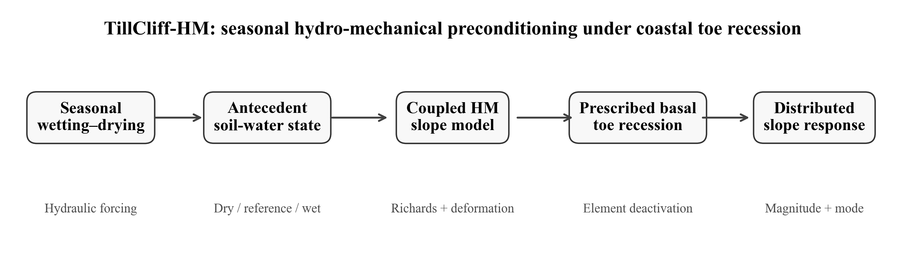
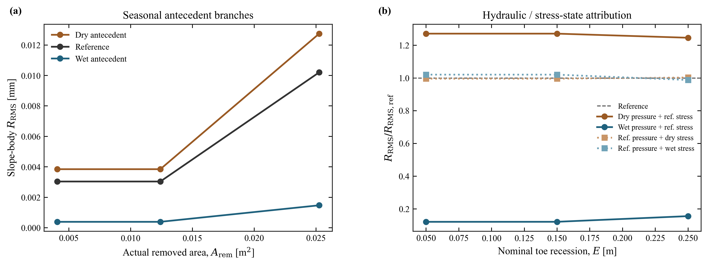
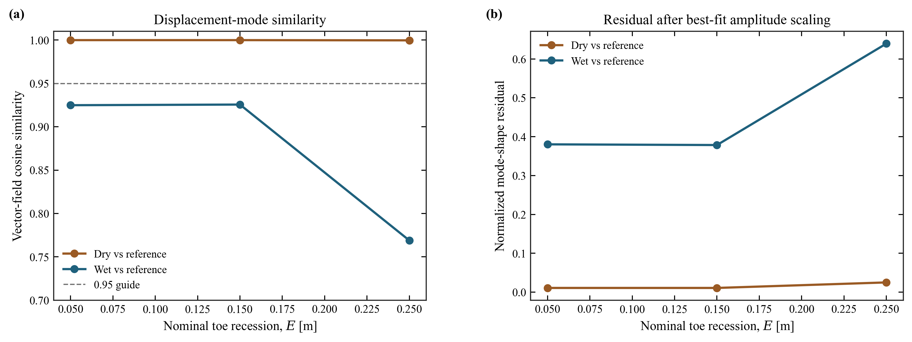
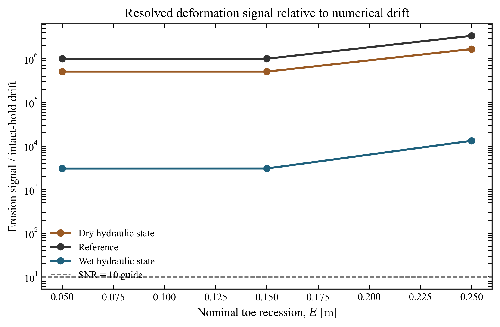

# TillCliff-HM

### Seasonal hydro-mechanical preconditioning of a North-European clayey glacial-till slope under prescribed coastal toe recession

[](https://github.com/ndimassaputro/tillcliff-hm/releases)
[](https://www.python.org/)
[](https://www.opengeosys.org/)
[](#mechanical-model)
[](LICENSE)
[](#scope-and-limitations)

**Nurwahid Dimas Saputro · 2026**

A computational geomechanics mini-study developed to investigate how
**seasonal antecedent hydraulic state** modifies the distributed mechanical
response of a clayey glacial-till slope subjected to **prescribed coastal toe
recession**.

<p align="center">
  
</p>

---

## Abstract

Seasonal wetting and drying modify pore pressure, saturation, and effective
stress before coastal erosion acts on a slope. This project examines whether
those antecedent hydro-mechanical conditions influence the subsequent
deformation generated by an identical prescribed toe-recession sequence.

A two-dimensional unsaturated slope model was developed in **OpenGeoSys
6.5.8**, combining Richards flow, deformation, deformation-dependent porosity,
gravity, and a Mohr–Coulomb constitutive description implemented through
MFront. The hydraulic archetype is informed by published Danish clayey
glacial-till data, while the mechanical properties are explicitly treated as
screening assumptions rather than site-calibrated measurements.

Dry, reference, and wet antecedent branches were transferred to a common
production mesh and tested under identical geometric toe recession.
A controlled pressure/stress factorial decomposition was then used to separate
the influence of hydraulic state from the inherited effective-stress field.

Within the present model, antecedent hydraulic state strongly controls the
**magnitude and spatial mode** of the distributed slope response. At
\(E=0.25\) m, with inherited effective stress fixed at the reference state,
the dry hydraulic state produces approximately **1.246 times** the reference
RMS response, whereas the wet hydraulic state produces approximately
**0.156 times** the reference response. Replacing inherited stress alone
changes the response by only about one percent. The wet-state displacement
field also departs progressively from the reference deformation mode, with
cosine similarity decreasing to **0.7689** at \(E=0.25\) m.

Mesh-refinement and localization diagnostics demonstrate that notch-front
plasticity and solver nonconvergence are not mesh-objective. They are therefore
excluded from physical failure interpretation.

> **Main finding:** in this screening formulation, antecedent hydraulic state
> controls not only the amplitude but also the spatial structure of
> erosion-induced distributed deformation; the attribution experiment indicates
> that this effect is predominantly hydraulic rather than inherited-stress
> driven.

---

## 1. Research question

> **How does antecedent seasonal hydraulic state alter the distributed
> deformation response of a clayey glacial-till slope to prescribed coastal
> toe recession?**

The project originally examined whether an erosion threshold
\(E_{\mathrm{crit}}\) could be identified. That interpretation was abandoned
after mesh studies demonstrated that local notch-front plasticity and
nonconvergence depend strongly on the discrete element-deactivation topology.

The revised research question therefore focuses on **distributed,
mesh-conditional deformation response**, rather than a failure threshold.

---

## 2. Physical and numerical framework

### 2.1 Geological context

The hydraulic screening archetype is based on published observations of
unsaturated fractured clayey till at **Avedøre, Denmark**, reported by
Mortensen et al. (2004).

The paper provides a Danish context for:

- clayey glacial-till stratigraphy;
- shallow seasonal groundwater fluctuations;
- unsaturated fractured conditions;
- low-permeability till matrix behaviour.

The present model is **not** a site-calibrated reconstruction of Avedøre.

### 2.2 Hydraulic model

Unsaturated water flow is represented using the Richards equation with a
van Genuchten-type retention formulation.

The model adopts a low intrinsic permeability consistent with the order of
magnitude reported for Danish clayey till and explicitly resolves seasonal
changes in pore pressure and degree of saturation.

Three antecedent branches are retained:

| State | Interpretation |
|---|---|
| **Dry** | greater suction / lower saturation |
| **Reference** | intermediate hydraulic condition |
| **Wet** | lower suction / higher saturation |

After transfer to the production mesh, all three states preserve the required
ordering:

\[
p_{\mathrm{dry}}
<
p_{\mathrm{ref}}
<
p_{\mathrm{wet}}
\]

and

\[
S_{r,\mathrm{dry}}
<
S_{r,\mathrm{ref}}
<
S_{r,\mathrm{wet}}.
\]

### 2.3 Mechanical model

The mechanical formulation contains:

- gravity;
- elastic stiffness prior to yielding;
- Biot coupling;
- deformation-dependent porosity;
- Mohr–Coulomb plasticity;
- MFront constitutive integration.

The adopted mechanical parameters are **screening assumptions** and must not be
interpreted as measured properties of a specific Danish till site.

### 2.4 Coastal toe recession

Coastal erosion is represented as a **process-informed prescribed basal
toe-recession sequence** using element deactivation.

The continuation coordinate is numerical.

It does not represent:

- resolved wave loading;
- sediment transport;
- hydrodynamic scour;
- a physical erosion rate.

---

## 3. Analysis design

The computational sequence is:

\[
\text{seasonal HM forcing}
\rightarrow
\text{antecedent state}
\rightarrow
\text{MC equilibrium}
\rightarrow
\text{toe recession}
\rightarrow
\text{distributed deformation}.
\]

The main slope-body metric is

\[
R_{\mathrm{RMS}}
=
\sqrt{
\frac{1}{N}
\sum_{i=1}^{N}
\left\|
\Delta \mathbf{u}_i
\right\|^2
},
\]

evaluated in a fixed monitoring region excluding the immediate notch-front
localization zone.

A 95th-percentile displacement magnitude is retained as a complementary
distributed-response metric.

---

## 4. Results

### 4.1 Antecedent state changes erosion-induced deformation

The production seasonal branches show a clear separation in distributed
slope-body response under identical realized toe geometry.

<p align="center">
  
</p>

**Figure 1.** (a) Distributed deformation for the dry, reference, and wet
seasonal branches as a function of actual removed toe area.
(b) Controlled hydraulic/effective-stress decomposition.

At nominal toe recession \(E=0.25\) m, under a common reference inherited
stress state:

| Numerical experiment | \(R_{\mathrm{RMS}}/R_{\mathrm{ref}}\) |
|---|---:|
| Dry pressure + reference stress | **1.2456** |
| Reference pressure + reference stress | **1.0000** |
| Wet pressure + reference stress | **0.1558** |
| Reference pressure + dry stress | **1.0027** |
| Reference pressure + wet stress | **0.9876** |

The hydraulic-state perturbation is therefore much larger than the
inherited-stress perturbation over the tested range.

This is a **numerical attribution result**, not a universal physical statement
that wetting stabilizes clayey slopes.

---

### 4.2 Hydraulic state also changes deformation mode

To determine whether hydraulic state merely scales one common displacement
pattern, the full slope-body displacement vectors were compared using cosine
similarity,

\[
C =
\frac{
\Delta \mathbf{u}_{H}
\cdot
\Delta \mathbf{u}_{\mathrm{ref}}
}{
\left\|
\Delta \mathbf{u}_{H}
\right\|
\left\|
\Delta \mathbf{u}_{\mathrm{ref}}
\right\|
}.
\]

<p align="center">
  
</p>

**Figure 2.** (a) Cosine similarity of pressure-controlled dry and wet
displacement fields relative to the reference state.
(b) Normalized residual after optimal scalar amplitude fitting.

The dry and reference responses remain nearly collinear:

\[
C_{\mathrm{dry/ref}}
\ge
0.99969.
\]

The wet/reference similarity decreases with recession:

| \(E\) [m] | Wet/reference cosine |
|---:|---:|
| 0.05 | **0.9249** |
| 0.15 | **0.9256** |
| 0.25 | **0.7689** |

The wet response is therefore not simply a reduced-amplitude copy of the
reference displacement field.

---

### 4.3 Mode difference is well above numerical drift

Because the wet response is small in absolute magnitude, a final numerical
signal-floor test was performed using late-stage intact-hold displacement drift.

<p align="center">
  
</p>

**Figure 3.** Ratio between erosion-induced slope-body response and intact-hold
numerical displacement drift.

The minimum wet-state signal-to-drift ratio is

\[
\mathrm{SNR}_{\mathrm{wet,min}}
\approx
3.07\times10^{3}.
\]

The observed wet/reference mode difference is therefore numerically resolved
relative to the measured intact-hold drift floor.

---

## 5. Numerical credibility and negative result

An important outcome of this project is also what **was not claimed**.

A local moving-front erosion formulation was tested on coarse, medium, and fine
toe meshes. The intact medium and fine meshes agreed closely before erosion,
but local EquivalentPlasticStrain and solver nonconvergence shifted strongly
when the discrete element-removal topology changed.

Localization audits showed that plastic hotspots remained attached to the
active/eroded notch interface.

Therefore:

> **solver nonconvergence is not interpreted as physical slope failure.**

Likewise:

- no physical \(E_{\mathrm{crit}}\) is reported;
- no factor of safety is inferred;
- no landslide initiation threshold is inferred from local plastic strain;
- notch-front mesh sensitivity is reported rather than hidden.

The monitored distributed slope body remains elastic over the primary common
comparison range.

---

## 6. Interpretation

The defensible model-specific conclusion is:

> **Antecedent hydraulic state strongly modifies the distributed deformation
> generated by prescribed coastal toe recession. In the tested formulation,
> the hydraulic component dominates the inherited effective-stress component,
> and sufficiently wet antecedent conditions modify both deformation amplitude
> and displacement-field structure.**

The result should **not** be translated into the statement that wetting
universally stabilizes natural clay slopes.

The observed ordering emerges from this particular coupled formulation,
geometry, hydraulic constitutive description, boundary conditions, and
screening mechanical parameter set.

---

## 7. Scope and limitations

| Item | Status |
|---|---|
| Coupled unsaturated flow–deformation | **Included** |
| Seasonal dry/reference/wet antecedent states | **Included** |
| Deformation-dependent porosity | **Included** |
| Mohr–Coulomb constitutive response | **Included** |
| Danish clayey-till hydraulic context | **Literature anchored** |
| Site-specific Danish mechanical calibration | **Not included** |
| Wave-resolved coastal erosion | **Not included** |
| Sediment transport | **Not included** |
| Mesh-objective post-localization model | **Not included** |
| Physical failure threshold | **Not claimed** |
| Hazard/risk prediction | **Outside scope** |

---

## 8. Reproducibility

The compact numerical tables behind the main figures are included in
`data/processed/`.

```text
data/processed/
├── antecedent_state_comparison.csv
├── decomposition_response.csv
├── mode_shape_audit.csv
└── signal_to_drift_audit.csv
```

Rebuild the figures with:

```bash
conda env create -f environment.yml
conda activate tillcliff-hm

python src/make_publication_figures.py
```

The complete raw VTU/PVD solver histories are intentionally excluded from the
repository because of their size.

---

## 9. Repository structure

```text
tillcliff-hm/
├── README.md
├── LICENSE
├── CITATION.cff
├── references.bib
├── environment.yml
├── data/
│   └── processed/
├── docs/
│   ├── methods.md
│   └── results.md
├── figures/
│   ├── fig00_graphical_abstract.*
│   ├── fig01_hydraulic_state_response.*
│   ├── fig02_deformation_mode.*
│   └── fig03_signal_quality.*
├── model/
│   └── OpenGeoSys project files
└── src/
    └── model-building and analysis scripts
```

---

## 10. References actually used

**Danish clayey-till hydraulic context**

1. Mortensen, A. P., Jensen, K. H., Nilsson, B., & Juhler, R. K. (2004).
   *Multiple Tracing Experiments in Unsaturated Fractured Clayey Till*.
   **Vadose Zone Journal, 3**(2), 634–644.
   https://doi.org/10.2136/vzj2004.0634

**Unsaturated hydraulic formulation**

2. Mualem, Y. (1976).
   *A new model for predicting the hydraulic conductivity of unsaturated porous
   media*. **Water Resources Research, 12**(3), 513–522.
   https://doi.org/10.1029/WR012i003p00513

3. van Genuchten, M. T. (1980).
   *A closed-form equation for predicting the hydraulic conductivity of
   unsaturated soils*. **Soil Science Society of America Journal, 44**(5),
   892–898.
   https://doi.org/10.2136/sssaj1980.03615995004400050002x

**Mohr–Coulomb constitutive implementation**

4. Abbo, A. J., & Sloan, S. W. (1995).
   *A smooth hyperbolic approximation to the Mohr–Coulomb yield criterion*.
   **Computers & Structures, 54**(3), 427–441.
   https://doi.org/10.1016/0045-7949(94)00339-5

5. Abbo, A. J., Lyamin, A. V., Sloan, S. W., & Hambleton, J. P. (2011).
   *A C2 continuous approximation to the Mohr–Coulomb yield surface*.
   **International Journal of Solids and Structures, 48**(21), 3001–3010.
   https://doi.org/10.1016/j.ijsolstr.2011.06.021

**Numerical software**

6. Kolditz, O., Bauer, S., Bilke, L., et al. (2012).
   *OpenGeoSys: an open-source initiative for numerical simulation of
   thermo-hydro-mechanical/chemical (THM/C) processes in porous media*.
   **Environmental Earth Sciences, 67**(2), 589–599.
   https://doi.org/10.1007/s12665-012-1546-x

7. Helfer, T., Michel, B., Proix, J.-M., Salvo, M., Sercombe, J., &
   Casella, M. (2015).
   *Introducing the open-source MFront code generator: Application to
   mechanical behaviours and material knowledge management within the PLEIADES
   fuel element modelling platform*.
   **Computers & Mathematics with Applications, 70**(5), 994–1023.
   https://doi.org/10.1016/j.camwa.2015.06.027

8. OpenGeoSys Community (2026).
   **OpenGeoSys 6.5.8**, software release used for the reported simulations.
   https://www.opengeosys.org/stable/releases/6.5.8/

BibTeX entries are provided in [`references.bib`](references.bib).

---

## 11. Citation

If referring specifically to this computational study:

```text
Saputro, N. D. (2026).
TillCliff-HM: Seasonal hydro-mechanical preconditioning of a
North-European clayey glacial-till slope under prescribed coastal
toe recession. Version 1.0.1.
```

Machine-readable metadata are available in [`CITATION.cff`](CITATION.cff).

---

## 12. License

Project code, documentation, and original figures are released under the
**BSD 3-Clause License**.

See [`LICENSE`](LICENSE).

Third-party software, publications, and external datasets remain subject to
their respective original licenses and copyright terms.
