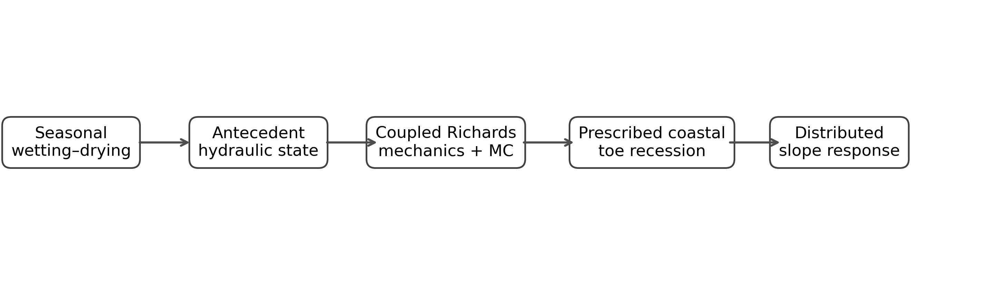
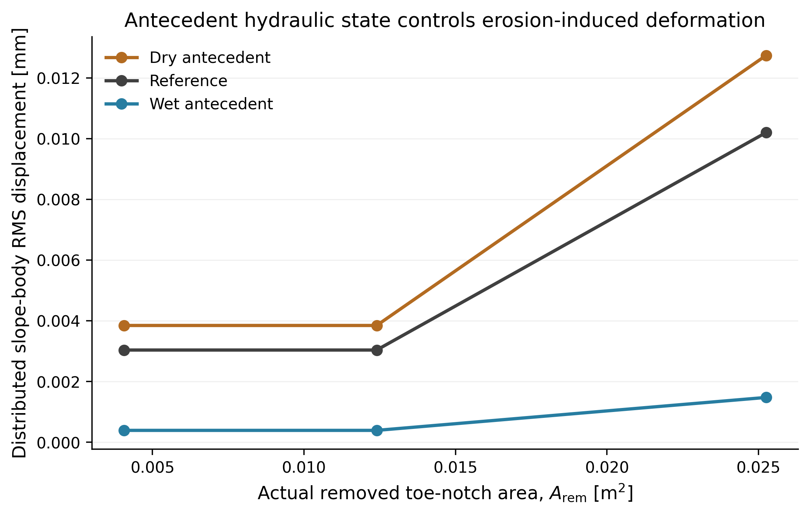
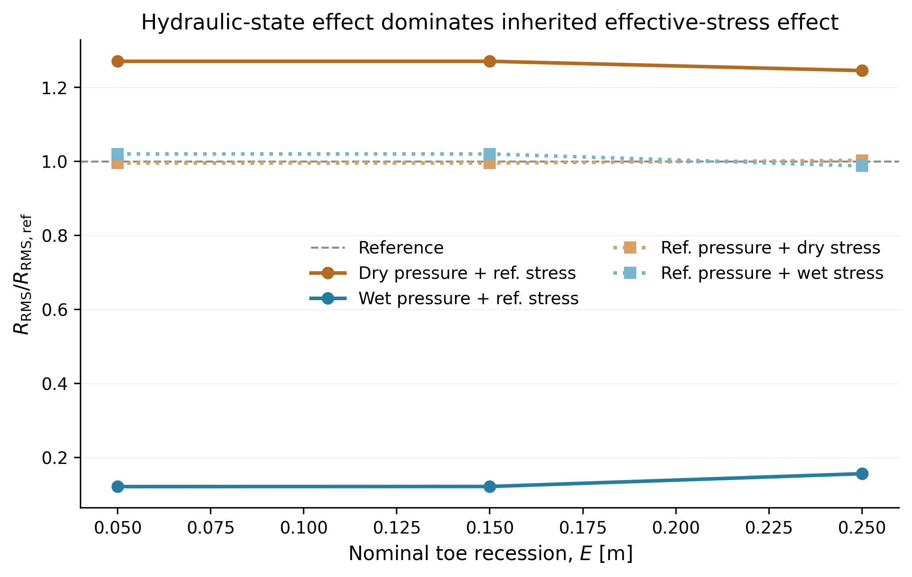
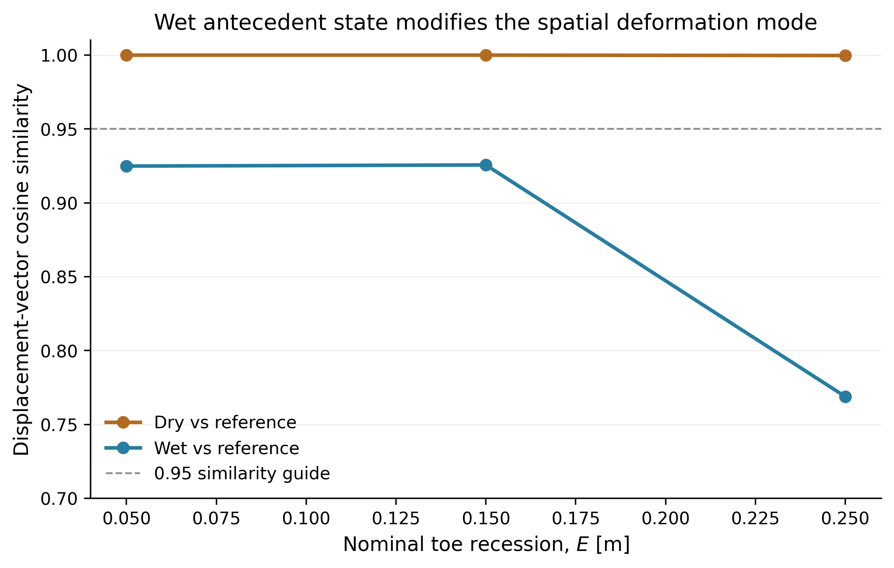
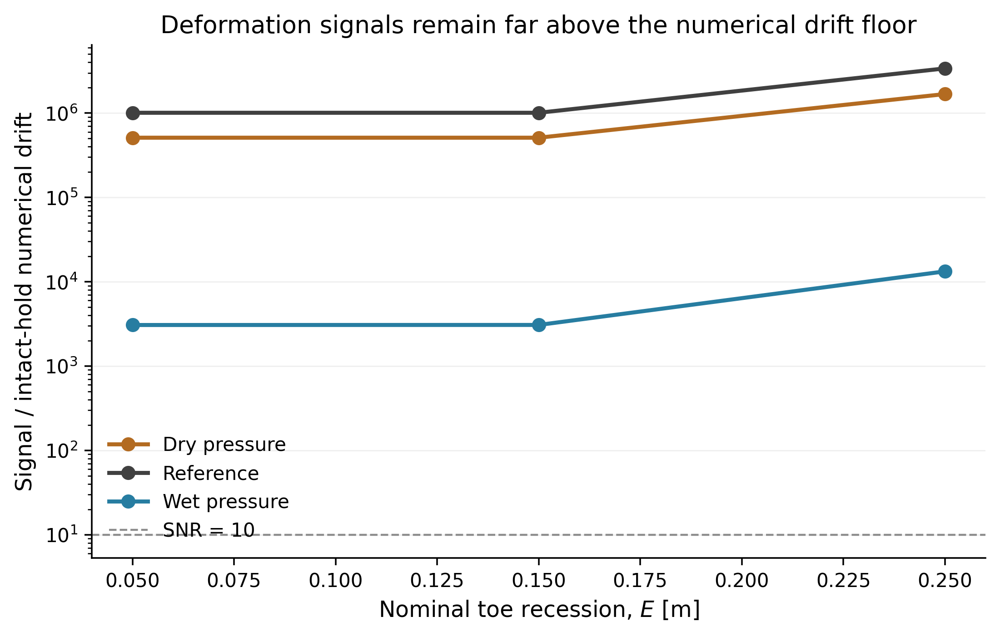

# TillCliff-HM

## Seasonal Hydro-Mechanical Preconditioning and Toe-Erosion Sensitivity of a North-European Clayey Glacial-Till Slope

A computational geomechanics portfolio study of how antecedent seasonal
wetting–drying modifies the response of a clayey glacial-till slope to
prescribed coastal toe recession.

The model combines unsaturated Richards flow, deformation, and a
Mohr–Coulomb constitutive description in **OpenGeoSys 6.5.8**.

> **Scope:** Danish/North-European clayey glacial-till hydraulic screening
> archetype. This is not a calibrated site model and is not a hazard or risk
> prediction tool.



---

## Research question

**How does antecedent seasonal hydraulic state alter the distributed
deformation response of a clayey glacial-till slope to prescribed coastal toe
recession?**

The original study also investigated whether a critical erosion distance could
be defined. Mesh-refinement tests showed that local notch-front plasticity and
solver nonconvergence were strongly affected by the discrete element-removal
topology. Those quantities were therefore **not interpreted as physical
failure thresholds**.

---

## Main result

Within the present screening model, antecedent hydraulic state strongly changed
both the **magnitude** and **spatial mode** of distributed slope deformation
caused by identical prescribed toe recession.

At a nominal recession of **0.25 m**, with inherited effective stress held at
the reference state:

| Case | RMS response / reference |
|---|---:|
| Dry hydraulic state | **1.246** |
| Reference | **1.000** |
| Wet hydraulic state | **0.156** |

A separate pressure/stress factorial decomposition showed that replacing the
hydraulic state produced the dominant change, whereas replacing inherited
effective stress alone changed the response by only about one percent at the
same erosion state.





---

## Deformation-mode result

The dry and reference displacement fields remained almost collinear:

- minimum dry/reference cosine similarity: **0.99969**

The wet response exhibited a distinct spatial displacement mode as recession
increased:

- wet/reference cosine at 0.05 m: **0.9249**
- wet/reference cosine at 0.15 m: **0.9256**
- wet/reference cosine at 0.25 m: **0.7689**



This difference is not an intact-equilibrium drift artifact. The minimum
wet-case signal-to-drift ratio across the evaluated states was approximately
**3.07 × 10³**.



---

## Numerical integrity checks

Several diagnostics were deliberately used to prevent over-interpretation.

### 1. Coupled hydro-mechanical verification

The workflow was developed from OpenGeoSys Richards and Richards-mechanics
benchmarks before moving to the slope model.

### 2. Seasonal antecedent states

Dry, reference, and wet states preserved the required hydraulic ordering after
transfer to the Mohr–Coulomb medium mesh:

\[
p_\mathrm{dry}
<
p_\mathrm{reference}
<
p_\mathrm{wet}
\]

and

\[
S_{r,\mathrm{dry}}
<
S_{r,\mathrm{reference}}
<
S_{r,\mathrm{wet}}.
\]

All three intact Mohr–Coulomb initialization holds converged with zero
equivalent plastic strain.

### 3. Mesh-sensitivity audit

A moving element-deactivation front produced strongly mesh-dependent local
plasticity and nonconvergence. Localization audits showed that the maximum
equivalent plastic strain stayed directly adjacent to the active/eroded
interface.

Therefore:

- solver nonconvergence is **not** used as physical failure;
- pointwise notch-front plastic strain is **not** used as a global instability
  criterion;
- no physical \(E_\mathrm{crit}\) is claimed.

### 4. Distributed response

The primary comparison uses slope-body displacement metrics that exclude the
notch-front localization zone.

The monitored slope body remained elastic over the common dry/reference/wet
comparison range.

---

## Scientific interpretation

The result supported by this model is:

> **Antecedent hydraulic state can strongly alter the incremental distributed
> deformation generated by the same prescribed coastal toe recession, and in
> the present model it alters both response amplitude and displacement-field
> structure.**

The pressure/stress decomposition indicates that this numerical response is
controlled primarily by the hydraulic-state component rather than differences
in the inherited effective-stress field.

This is a **model-specific numerical attribution**, not a universal causal law.

In particular, the results do **not** establish that:

- wetting universally stabilizes clayey slopes;
- the wet state has a larger or smaller physical factor of safety;
- solver nonconvergence represents landslide initiation;
- the prescribed erosion time corresponds to physical coastal erosion rate;
- the model is calibrated to a specific Danish site.

---

## Modelling scope

### Hydraulics

The hydraulic screening archetype is informed by published Danish clayey
glacial-till properties.

Representative screening quantities include:

- low matrix hydraulic conductivity on the order of \(10^{-9}\) m/s;
- high but suction-dependent degree of saturation;
- van Genuchten-type retention.

### Mechanics

Mechanical properties are **screening assumptions**, not measured Danish-site
parameters.

The production screening model uses:

- linear-elastic stiffness before yielding;
- Mohr–Coulomb plasticity;
- coupled pressure–deformation formulation;
- deformation-dependent porosity;
- gravity.

### Coastal erosion

Toe erosion is represented as a **process-informed prescribed geometric
recession / element deactivation sequence**.

It is not:

- CFD;
- wave-resolved;
- sediment-transport resolved.

---

## Repository structure

```text
tillcliff-hm/
├── README.md
├── CITATION.cff
├── environment.yml
├── figures/
│   ├── fig00_workflow.*
│   ├── fig01_antecedent_hydraulic_response.*
│   ├── fig02_pressure_stress_decomposition.*
│   ├── fig03_deformation_mode_similarity.*
│   └── fig04_signal_to_drift.*
├── data/
│   └── processed/
│       ├── antecedent_state_comparison.csv
│       ├── decomposition_response.csv
│       ├── mode_shape_audit.csv
│       └── signal_to_drift_audit.csv
├── docs/
│   ├── methods.md
│   └── results.md
├── src/
│   └── analysis and model-building scripts
└── model/
    └── OpenGeoSys project definitions
```

Large VTU/PVD solver outputs are intentionally excluded from version control.
The compact processed tables underlying the public figures are included.

---

## Reproduce the public figures

```bash
conda env create -f environment.yml
conda activate tillcliff-hm

python src/make_publication_figures.py
```

The full OGS analysis was performed with **OpenGeoSys 6.5.8**.

---

## Key processed datasets

The four tables in `data/processed/` contain the numerical values behind the
headline figures:

- `antecedent_state_comparison.csv`
- `decomposition_response.csv`
- `mode_shape_audit.csv`
- `signal_to_drift_audit.csv`

---

## Status

**v1.0.0 — portfolio release**

The modelling phase is frozen at the point where the principal finding is
supported by:

- hydraulic-state ordering;
- intact Mohr–Coulomb equilibrium checks;
- mesh-localization diagnostics;
- pressure/stress decomposition;
- deformation-mode analysis;
- signal-to-numerical-drift verification.

---

## Author

**Nurwahid Dimas Saputro**

Computational geomechanics portfolio project, 2026.
